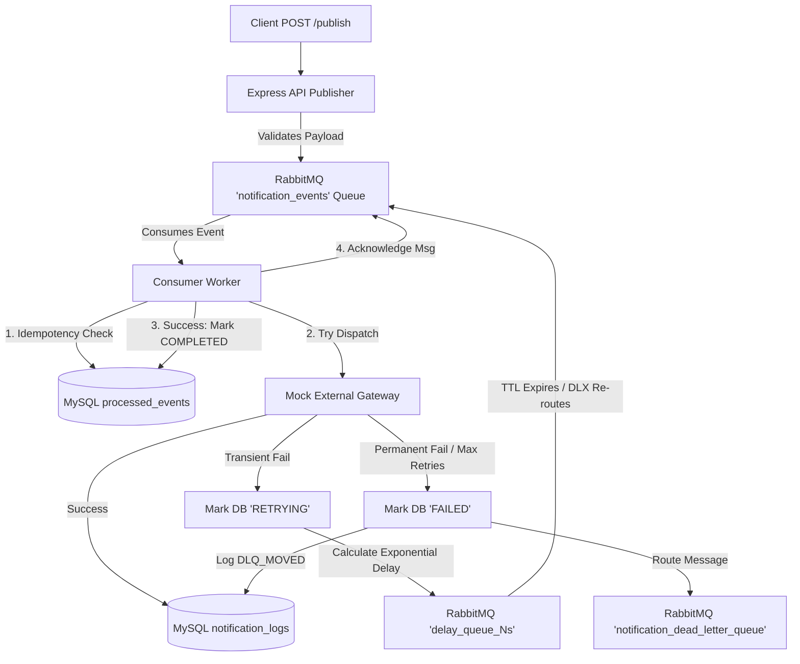

# Event-Driven Notification Service

A robust, fault-tolerant, and highly available notification service leveraging event-driven architecture to process email, SMS, and push notification dispatches reliably. The service is built with Node.js, Express, MySQL, and RabbitMQ, showcasing advanced messaging patterns including atomic idempotency, non-blocking exponential backoff retries, and dead-letter queues (DLQ).

---

## 🌟 Features
- **Publisher-Consumer Decoupling**: An API publisher validating and enqueuing payloads, separate from the background worker.
- **Payload Validation**: Strict Joi-based verification of event properties, including conditional formatting constraints for email address, E.164 phone formats, and device tokens.
- **Atomic Idempotency State Machine**: Double-check-and-process cycle using MySQL queries (`INSERT` + atomic state transitions) to ensure exactly-once delivery guarantees under high concurrency.
- **Resilient Retry Loop**: Dynamic, non-blocking exponential backoff delays using RabbitMQ TTL delay queues, avoiding worker thread blocking and head-of-line blocking.
- **Dead-Letter Queue (DLQ)**: Automatic routing of permanently failed messages or exhausted retries to a dedicated inspectable queue (`notification_dead_letter_queue`).
- **Structured Logs**: Consistent JSON logs with correlation IDs (`event_id`) to track the complete message lifecycle.
- **Graceful Shutdown**: Interception of `SIGINT` / `SIGTERM` to safely drain in-flight messages and close database and queue connection pools.

---

## 🛠️ Technologies Used
- **Runtime**: Node.js (v20 Alpine)
- **Web Server**: Express.js
- **Message Broker**: RabbitMQ
- **Database**: MySQL (v8.0)
- **Testing Suite**: Jest & Supertest
- **Containerization**: Docker & Docker Compose

---

## 🚀 Setup & Execution

### Prerequisites
- Docker (with Docker Compose support)

### Running the Services
1. Clone this repository to your workspace.
2. Initialize environment variables (copy example template):
   ```bash
   cp .env.example .env
   ```
3. Boot up the entire docker-compose stack:
   ```bash
   docker compose up -d --build
   ```
4. Verify that all three services boot up and pass their health checks:
   ```bash
   docker compose ps
   ```

---

## 📡 API Documentation

### **Publish Notification Event**
Enqueues a notification event payload to RabbitMQ to be consumed asynchronously by the worker.

* **Endpoint**: `/api/v1/publish-notification-event`
* **Method**: `POST`
* **Headers**: `Content-Type: application/json`

#### **Request Body Schema**
* `event_id` (string, UUIDv4, mandatory): Unique identifier used to enforce idempotency.
* `type` (string, enum, mandatory): Type of notification. Supported values: `email`, `sms`, `push`.
* `recipient` (string, mandatory): Destination identifier. Must be a valid email string for `email` type, E.164 phone number pattern for `sms`, and a non-empty string device token for `push`.
* `payload` (object, mandatory): Payload data containing notification contents (e.g., subject, message body).
* `timestamp` (string, ISO 8601, mandatory): ISO date timestamp.

#### **Request Example (Email)**
```json
{
  "event_id": "a9cf4e81-cf19-4b6a-93ef-62e92c608f65",
  "type": "email",
  "recipient": "user@example.com",
  "payload": {
    "subject": "Welcome!",
    "body": "Hello and welcome to our platform."
  },
  "timestamp": "2026-07-15T12:00:00.000Z"
}
```

#### **Responses**
* **`202 Accepted`**: Message enqueued successfully.
  ```json
  {
    "message": "Accepted",
    "event_id": "a9cf4e81-cf19-4b6a-93ef-62e92c608f65"
  }
  ```
* **`400 Bad Request`**: Malformed body schema or invalid type formats.
  ```json
  {
    "error": "Bad Request",
    "details": [
      "\"recipient\" must be a valid email"
    ]
  }
  ```
* **`500 Internal Server Error`**: Publisher failed to connect or write to RabbitMQ.
  ```json
  {
    "error": "Internal Server Error",
    "message": "Failed to publish event to message queue"
  }
  ```

---

## 📐 Architecture & Reliability Mechanisms



### **1. Idempotency Mechanism**
To guarantee exactly-once processing under redeliveries or broker reconnects, the database state-machine functions as follows:
- When a worker consumes an event, it attempts to insert a record into the `processed_events` table: `INSERT INTO processed_events (event_id, status) VALUES (eventId, 'PROCESSING')`.
- If the insert succeeds, the worker proceeds to simulate dispatch.
- If the insert fails with a unique key conflict (`ER_DUP_ENTRY`), the worker checks if the status is `'RETRYING'`. If so, it transitions the status back to `'PROCESSING'` atomically: `UPDATE processed_events SET status = 'PROCESSING' WHERE event_id = ? AND status = 'RETRYING'`.
- If the update affects 1 row, it is allowed to process the retry. Otherwise, if it is `'COMPLETED'`, `'PROCESSING'` (running on another thread), or `'FAILED'` permanently, it is safely acknowledged and discarded.

### **2. Non-blocking Exponential Backoff Retry**
For transient errors:
- We calculate the delay dynamically: $\text{delay} = \text{initialDelay} \times (\text{backoffFactor}^{\text{retryAttempt} - 1})$
- Instead of blocking the node consumer thread, the worker declares a temporary delay queue in RabbitMQ (e.g., `delay_queue_2s`) with an argument TTL matching the delay and a dead-letter exchange (DLX) set to route back to `notification_events`.
- The message is published to this delay queue with `x-retry-count` incremented in its header. Upon expiration, RabbitMQ automatically re-enqueues it to the main consumer queue.

### **3. Dead-Letter Queue (DLQ)**
- If a message experiences a permanent failure (like a malformed validation error, or an invalid recipient address triggering a `PermanentError`), or if the retry attempt count exceeds `MAX_RETRIES`, the message is bypassed from the retry loop.
- The event's status is set to `'FAILED'` in `processed_events`, a log entry is written with status `'DLQ_MOVED'` in `notification_logs`, and the message is routed to `notification_dead_letter_queue` for manual audit and inspection.

---

## 🧪 Testing

### Running Tests
Execute Jest tests inside the active container. The integration test suite automatically connects to the real RabbitMQ and MySQL instances running inside docker-compose.

```bash
docker compose exec -T notification_service npm test
```

*Expected output:*
```text
PASS tests/integration/notification.test.js
PASS tests/unit/idempotency.test.js
PASS tests/unit/retry.test.js
PASS tests/unit/validation.test.js

Test Suites: 4 passed, 4 total
Tests:       20 passed, 20 total
```

---

## 🛠️ Troubleshooting

#### **Connection Errors**
If the application logs indicate database or queue connection errors, ensure the dependent containers have completed their initialization phases:
```bash
docker compose logs mysql_db
docker compose logs rabbitmq
```

#### **Database Inspection**
To log into the database container directly and check tables:
```bash
docker compose exec -it mysql_db mysql -u root -pnotifications_db
```
*Useful Queries:*
```sql
SELECT * FROM processed_events;
SELECT * FROM notification_logs;
```

#### **Queue Inspection**
Open the RabbitMQ management console at [http://localhost:15672](http://localhost:15672) (Credentials: `guest` / `guest`) to inspect queue depths, delay queues, and messages inside the Dead-Letter Queue.
